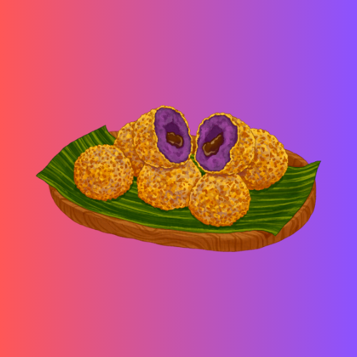

  <div class="image-container">
    <a href="#">
      <p></p>
    </a>
  </div>

<div align="center">
  <a aria-label="Join the community on Slack" href="https://mtify.hashnode.dev">
    
  </a>
  <a href="#">
    
  </a>
  <a href="https://github.com/ai-jiraphinya">
    
  </a>
  <a href="https://github.com/pripramot/pripramot/watchers">
    
  </a>
</div>

## โครงสร้าง JSON ง่ายๆ ที่สร้างขึ้นตามตัวอย่าง XML 
<details>
<summary>short-form.🔽</summary>

  
```json
{ "store": {
    "book": [ 
      { "category": "reference",
        "author": "Nigel Rees",
        "title": "Sayings of the Century",
        "price": 8.95
      },
      { "category": "fiction",
        "author": "Evelyn Waugh",
        "title": "Sword of Honour",
        "price": 12.99
      },
      { "category": "fiction",
        "author": "Herman Melville",
        "title": "Moby Dick",
        "isbn": "0-553-21311-3",
        "price": 8.99
      },
      { "category": "fiction",
        "author": "J. R. R. Tolkien",
        "title": "The Lord of the Rings",
        "isbn": "0-395-19395-8",
        "price": 22.99
      }
    ],
    "bicycle": {
      "color": "red",
      "price": 19.95
    }
  }
}

```


| XPath | JSONPath | Result |
|---|---|---|
| /store/book/author | $.store.book[*].author| the authors of all books in the store |
| //author	| $..author	| all authors |
| /store/* | 	$.store.* | 	all things in store, which are some books and a red bicycle. |
| /store//price | 	$.store..price | 	the price of everything in the store. |
| //book[3] | $..book[2] |	the third book |
| //book[last()] | .. | .. |


<h2 align="center">On the other hand</h2>

<div align="center">
<table>
  <tbody>
    <tr>
      <td align="center" valign="middle" width="600">
        <a href="#" target="_blank">
          
        </a>
      </td>
    </tr>
  </tbody>
</table>
</div>

<h2 align="center">Create a simple food menu</h2>

### Create a simple food menu
Hide something before placing the desired menu.⏬🦋Press to view
<details>
<summary>Phra Aphai Mani 🦋</summary>
<div align="center">
<table>
  <tbody>
    <tr>
      <td align="center" valign="middle" width="600">
        <a href="https://github.com/My-HackathonEducation-Th/mint" target="_blank">
          
        </a>
      </td>
    </tr>
  </tbody>
</table>
</div>
</details>

<div align="center">
<table>
  <tbody>
    <tr>
      <td align="center" valign="middle" width="200">
        <a href="https://acceleanation.com/" target="_blank">
          
        </a>
      </td>
      <td align="center" valign="middle" width="200">
        <a href="https://github.com/alexksso" target="_blank">
          
        </a>
      </td>
      <td align="center" valign="middle" width="200">
        <a href="https://github.com/broxen" target="_blank">
          
        </a>
      </td>
      <td align="center" valign="middle" width="200">
        <a href="https://github.com/xDacon" target="_blank">
          
        </a>
      </td>
      <td align="center" valign="middle" width="200">
        <a href="https://github.com/GigabiteLabs" target="_blank">
          
        </a>
      </td>
      <td align="center" valign="middle" width="200">
        <a href="https://www.hostwiki.com/" target="_blank">
          
        </a>
      </td>
    </tr>
    <tr>
      <td align="center" valign="middle" width="200">
        <a href="https://github.com/JayDaley" target="_blank">
          
        </a>
      </td>
      <td align="center" valign="middle" width="200">
        <a href="https://github.com/idokka" target="_blank">
          
        </a>
      </td>
      <td align="center" valign="middle" width="200">
        <a href="https://www.openhost-network.com/" target="_blank">
          
        </a>
      </td>
      <td align="center" valign="middle" width="200">
        <a href="https://www.prevo.ch/" target="_blank">
          
        </a>
      </td>
      <td align="center" valign="middle" colspan="200">
        <a href="https://github.com/sponsors/NGPixel" target="_blank">
          
        </a>
      </td>
    </tr>
  </tbody>
</table>
 
<h3> A content delivery network or content distribution network (CDN) is a globally distributed network of proxy servers deployed in multiple data centers. 
  I 🤟 Hash..node</h3>
   <br
     <div class="image-container">
 
 <div class="image-container">
<br

เตือนตนเองสิ่งที่ห้ามมองข้ามในการทำ SEO
สิ่งที่ทำให้img alt  Google เข้าใจเนื้อหาต่างๆ บนรูปภาพที่อยู่บนเว็บไซต์ของเราได้มากกว่าเดิม
decoding="async"ตทริบิวต์จะบอกเบราว์เซอร์ว่าการถอดรหัสรูปภาพสามารถทำได้ในภายหลัง
เพื่อให้เบราว์เซอร์สามารถแสดงเนื้อหาต่อไปได้แม้ว่ารูปภาพจะยังโหลดไม่ครบถ้วนก็ตาม

```java


``` 


 


   


</td></tr></tbody></table>
</div>
</details>


### Skills


<p align="left">
<a href="https://code.visualstudio.com/" target="_blank" rel="noreferrer"></a><a href="https://nuxtjs.org/" target="_blank" rel="noreferrer"></a><a href="https://www.mongodb.com/" target="_blank" rel="noreferrer"></a><a href="https://filebase.com/" target="_blank" rel="noreferrer"></a><a href="https://cloud.google.com/" target="_blank" rel="noreferrer"></a><a href="https://aws.amazon.com" target="_blank" rel="noreferrer"></a><a href="https://www.docker.com/" target="_blank" rel="noreferrer"></a><a href="https://www.tensorflow.org/" target="_blank" rel="noreferrer"></a>
</p>

  <a href="#">
   
    </a>
    
</details>
